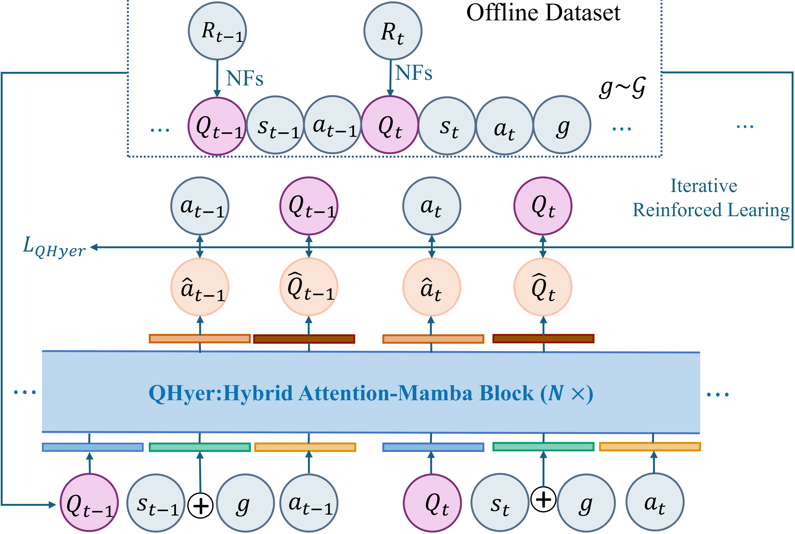

# Xing Lei (雷星) — Academic Homepage

A clean, minimalist academic personal homepage inspired by [wechto.github.io](https://wechto.github.io/).

## 🚀 Deploy to GitHub Pages

### Method 1: User site (recommended) — `leixingxing1.github.io`

1. Create a new repository on GitHub named **exactly** `leixingxing1.github.io` (must match your GitHub username).
2. Upload `index.html` to the repository root.
3. Upload your profile photo and paper thumbnails (see below).
4. Go to **Settings → Pages**, and ensure the source is set to `main` branch / root.
5. Visit `https://leixingxing1.github.io/` — your site is live!

### Method 2: Project site

1. Create any repo (e.g. `homepage`).
2. Upload `index.html`.
3. **Settings → Pages → Source: `main` branch**.
4. Site available at `https://leixingxing1.github.io/homepage/`.

## 📁 Recommended File Structure

```
leixingxing1.github.io/
├── index.html                  # main page (the only required file)
├── photo.jpg                   # your profile photo
├── images/                     # paper thumbnails
│   ├── qhyer.png
│   ├── gchr.png
│   ├── mgda.png
│   └── icip2019.png
├── files/
│   └── CV.pdf                  # your CV (optional)
└── README.md
```

---

## 📸 Adding Your Profile Photo

1. Save your photo as `photo.jpg` in the **same directory** as `index.html`.
   - Recommended size: ~400×500 px (portrait orientation, will be displayed at 160×200).
   - Square or portrait photos work best.
2. In `index.html`, find this block:
   ```html
   <div class="profile-photo">
     <!-- Replace with:  -->
     photo
   </div>
   ```
3. Replace the content with:
   ```html
   <div class="profile-photo">
     
   </div>
   ```

---

## 🖼️ Adding Paper Thumbnails

Each publication has space for a thumbnail image on the left side.

### Step 1: Create an `images/` folder

In your repository root, create a folder named `images/`.

### Step 2: Prepare thumbnail images

For each paper, prepare a thumbnail image. **Recommended:**
- **Dimensions**: ~280×180 px (or any 14:9 ratio, displayed at 140×90)
- **Format**: PNG or JPG
- **Content ideas**:
  - The key figure / architecture diagram from your paper
  - A teaser figure
  - A screenshot of the method overview
  - A simple text title card

### Step 3: Name your images

Use these exact filenames so they match the HTML:

| Paper | Filename |
|-------|----------|
| QHyer (ICML 2026) | `images/qhyer.png` |
| GCHR (arXiv 2025) | `images/gchr.png` |
| MGDA (AAAI 2025) | `images/mgda.png` |
| Hardware Friendly CNN (ICIP 2019) | `images/icip2019.png` |

### Step 4: Activate images in HTML

For each paper in `index.html`, find a block like this:

```html
<div class="pub-thumb">
  <!-- Replace with:  -->
  <div class="thumb-placeholder">qhyer.png</div>
</div>
```

And replace it with:

```html
<div class="pub-thumb">
  
</div>
```

Repeat for all 4 papers.

**💡 Tip:** If you don't have a thumbnail yet, just leave the placeholder — the page still looks clean with the gray placeholder showing the filename. Add images later as you make them.

---

## 🎨 Customization Tips

- **Accent color** — change `--accent` in CSS (currently deep burgundy `#8b2635`). Try:
  - `#1e40af` (navy)
  - `#065f46` (forest green)
  - `#7c2d12` (rust)
  - `#0c4a6e` (steel blue)
- **Add CV link** — add `<a href="files/CV.pdf" target="_blank">CV</a>` inside `<div class="links">`, then upload your CV PDF to a `files/` folder.
- **Add new publications** — copy an existing `<li class="pub-item">` block and edit content. Numbering is automatic.
- **Add new news items** — copy any existing `<li>` in the news list and edit.
- **Add new sections** (e.g. Teaching, Awards) — copy any `<section>` block.

---

## ✨ Features

- Responsive design (mobile-friendly — thumbnails shrink automatically)
- Subtle fade-in animations on load
- Academic-grade typography (Crimson Pro + IBM Plex Sans + JetBrains Mono)
- Auto-numbered publication list
- Bolded self-name on publications
- Hover effects on paper thumbnails
- Clean, accessible link styling
- Lightweight (single HTML file, no build step, no dependencies beyond Google Fonts)

---

## 🛠️ Quick Local Preview

To preview locally before deploying:

```bash
# Option 1: Python
python3 -m http.server 8000

# Option 2: Node.js
npx serve .
```

Then open `http://localhost:8000` in your browser.
